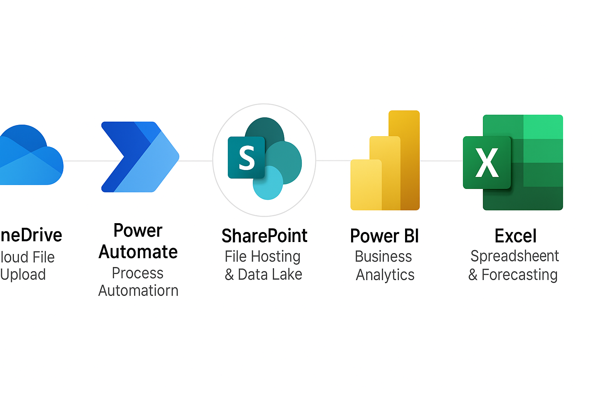
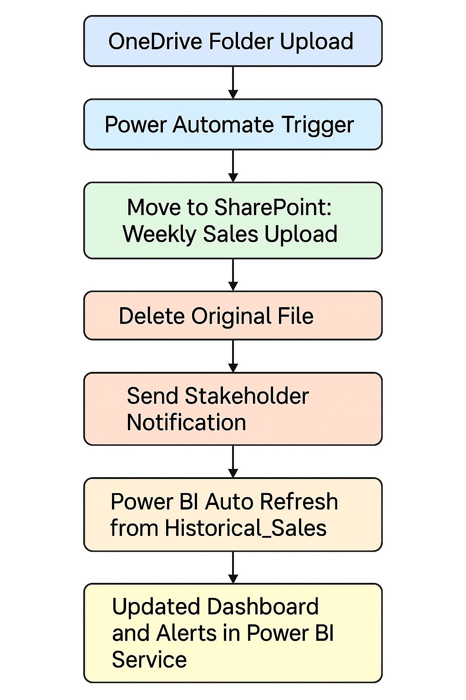
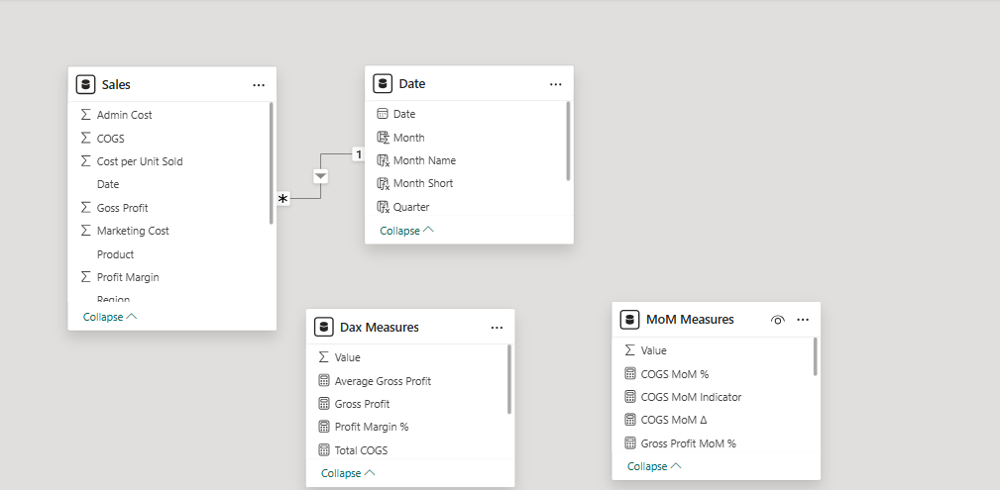
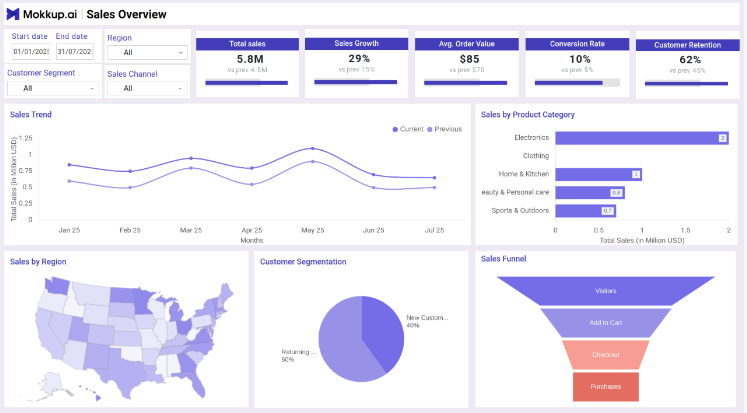

# Automated-Sales-Report-Process

## Automated Weekly Sales Workflow & Forecasting using Power Automate, Power BI, and Excel 



# Table of Content
- [Project Title](#project-title)
- [My Role](#my-role)
- [Project Overvies](#project-overview)
- [Problem Statement](#problem-statement)
- [Stakeholder Engagement](#stakeholder-engagement)
  - [Target stakeholder](#target-stakeholder)
  - [Use Cases](#use-cases)
  - [Stakeholder Stories](#stakeholder-stories)
  - [Acceptance-Criteria](#acceptance-criteria)
  - [Success Criteria](#success-criteria)
- [Data Source](#data-source)
  - [Dataset](#dataset)
  - [Data model stucture](#data-model-structure)
- [Methodolody](#methodology)
  - [Tool Used](#tool-used)
  - [Development](#development)
    - [Project Planning & Requirement gathering](#project-planning--requirement-gathering)
    - [Data Exploration & Profiling](#data-exploration--profiling)
    - [Automation Workflow_Using Power Automate OneDrive and SharePoint](#automation_workflow_using_power_automate,_onedrive_and_sharepoint)
    - [ETL Process Using Power Query and Data modeling](#etl-process-using-power-query-and-data-modeling)
    - [Measures Developmenr Using DAX](#measures-development-using-dax)
    - [Dashboard Design & Visualisation](#dashboard-design--visualisation)
    - [Plushing and Collaboration](#publishing-and-collaboration)
    - [Documentation & Version control](#documentation--version-control)
    - [Review & Iteration](#review--iteration)
- [Detailed Insights and Recommendation](#detailed-insights-and-recommendations)
  - [CEO Executive Summary](#ceo-executive-summary)
- [P&L Statement and Financial Forecasting Model](#p&l_statement_and_financial_forecasting_model)
 

# Project Title
Automated Weekly Sales Workflow & Forecasting using POwer Automate, Power BI, and Excel.

# My Role
Business Intelligence Analyst & Workflow Automation Developer 

# Project Overview
This project automates the weekly sales data workflow, integrates historical data collection, and delivers real-time financial reporting and forecasting using OneDrive and SharePoint for Busines, Power Automate, Power BI, and Excel. 

# Problem Statement 
Manual handling of weekly sales reports created inefficiencies, inconsistency in reporting, and delays in decision-making. The lack of automation and centralised data limited the ability to conduct trend analysis, forecasting, and performance tracking. There is also need for preservation of time consume by manual work process, data and information protection to be considered and lastly due to unroutine task that could cause prevention smooth work process by lack of real-time data insight and decision making.

# Stakeholder Engagement 
Weekly sync with the Sales Team, Finance Department, and C-Suite to identify reporting needs and automate manual tasks. Workshops were held to to define KPIs and success measures.

# Target Stakeholders 
- Sale Managers
- Finacial Analyst
- Operations Director
- C-Level Excutive (CEO, CFO)

# Use Cases 
- Automatic detection and transfer of weekly Excel reports
- Data consolidation and historical archiving
- Real-time Power BI updates
- Alert notifications for performance thresholds
- Financial forecasting and variance detection

# Stakeholder Stories
- "As a Sale Manager, I want to be notified when weekly sales reports are ready so i can prepare my sales review."
- "As a Financial Analyst, I need consistenthistorical sale data to generate Monthly P&L reports"
- "As the CEO, I want real-time KPIs and forecast alerts to track performance against goals."


# Acceptance Criteria
- Sales files are detected and archived weekly or every 7days 
- Power BI dashboard updates automatically after each file upload
- Stakeholder recieve notification and alerts
- P&L forecast is generated based on YTD sales


# Success Criteria
- 100% automation of weekly file ingestion process
- Power BI report refresh time under 5 minutes post-upload
- Forecast Model generates accurate projections within 5% error margin


# Data Source
- Weekly Excel files from Sales Team (OneDrive)
- Hosted in SharePoint: /Shared Document/Weekly Sales Upload and /Historical_Sales

### **DATASET**  
Each file includes:  
- Date, Product, Region
- Unit Sold, Unit Price, Revenue
- Unit Cost, Admin Cost, Marketing Cost


### **DATA MODEL STRUCTURE**
- Fact Table: Weekly Sales
- Dimension Tables: Date (Time Intelligence)
- Calculated Columns: Total Cost, Gross Profit, Profit Margin, Cost per Unit

| Column Name | Data Type | Description |
| --- | --- | --- |
| Date | Date | Date of each transaction and this also serve as a unique identifier for each row   |
| Product | Text | product name being sold |
| Region | Text | Region location (geographical 4 cardinal point) of where sales occur |
| Unit Sold | Whole Number | Quantity of product sold |
| Unit Price | Number | The selling price of a single unit of a product before any cost is deducted |
| Revenue | Number | The total income generated from selling products, calculated as: Revenue = Unit Price x Units Sold |
| Unit Cost | Decimal Number | The cost to produceone unit of the product (Doesn't include admin or marketing costs.) |
| Admin Cost | Decimal Number | Additional fixed or variable administrative overhead attributed to the sales transaction or product line. |
| Marketing Cost | Decimal Number | Expenses incured for marketing activities directly related to the product or sales cycle. |


| Column Name | Data Type | Description |
| --- | --- | --- |
| Date | Date/DateTime | Full calendar date (serve as the primary key of the date table). |
| Year | Whole Number | 4-digit representation of the year. |
| Calendar | Whole | Calendar quarter number of the year (Q1-Q4) |
| Month Number | Whole Number | Numeric representation of the month (1-12) |
| Month Name | Text | Full name of the month (for readable labels in visuals) |
| Month Short | Text | Abbreviated Month name (useful for compact visuals). |
| Weekdays | Text | Full name of the weekday (based on the Date column). |


# Methodology 
Agile developmenmt with bi-weekly sprints, stakeholder demos, and flow testing.  

### Tool Used 
- Power Automate
- Power BI Desktop & Service
- Execl (for P&L and forecasting
- SharePoint and OneDrive for Business
- DAX & Power Query

### Development 

#### *Project Planning & and Requirement Gathering* 
Collaborated with Stakeholders to define the reporting cadence, file structure, and KPI expectations.


#### *Automation Workflow Using Power Automate, OneDrive and SharePoint*

- Sales team Uploads weekly Excel (more like every 7days sales) to: /GitHub/ Power Automate/Weekly Sale Data Upload (OneDrive for Business)
- Power Automate detects the upload and:
  - Moves the files to /Shared Documents/Weekly Sales Upload/ (SharePoint)
  - Delete the file from OneDrive to prevent clustter
  - Copies the files to an archival folder: /Historical_Sales/ (SharePoint)
  - Sends an email notification to stakeholders tat a new file has been processed
- Power BI is connected to the Historical_Sales folder using the SharePoint folder connector
- This enables automated appending of weekly data and dashboard refresh



#### *Data Exploration & Profiling*
Performed integrity checks and missing value analysis using Power Query. Identified outliers and ensured consistency. This was done by heading to the VIEW ribbon in power query which i then turn on column profile and quality in the VIEW tab, this allow me to check the integrity, missing value, error or outliers in the dataset.

#### *ETL Process Using Power Query and Data Modeling* 
- Used the Folder connector to combine Excel files
- Cleaned and transformed fields: Dates, Costs, Revenue
- Related fact and dimensiontables for robust analysis



#### *Measures Development Using DAX*
Created measures: 
- Total Revenue, Total COGS, Total Cost
- Gross Profit, Profit Margin %, Average Gross profit
- COGS MOM %, COGS MoM Indicator (Color-coded)
- Total Unit Sold, Cost per Unit

**KPIs DAX MEASURES**  
```Dax
Average Gross Profit = AVERAGE(Sales[Goss Profit])
```

```Dax
Gross Profit = [Total Revenue] - [Total Cost]
```

```Dax
Profit Margin % = DIVIDE([Gross Profit], [Total Revenue], 0)
```

```Dax
Total COGS = SUM(Sales[Unit Cost])
```

```Dax
Total Cost = 
SUMX('Sales',
 'Sales'[Unit Cost] * 'Sales'[Units Sold] + 'Sales'[Admin Cost] + 'Sales'[Marketing Cost])
```

```Dax
Total Revenue = SUM('Sales'[Revenue])
```

```Dax
Total Unit Sold = SUM('Sales'[Units Sold])
```


**MONTH OVER MONTH DAX MEASURES**  

```DAX
COGS MoM % = 
VAR SelectedMonth = MAX('Date'[Month])
VAR SelectedYear = MAX('Date'[Year])

VAR PreviousMnth = IF(SelectedMonth = 1, 12, SelectedMonth - 1)
VAR PreviousYr = IF(SelectedMonth = 1, SelectedYear - 1, SelectedYear)

VAR CurrentCOGS =
    CALCULATE(
        [Total COGS],
        'Date'[Month] = SelectedMonth,
        'Date'[Year] = SelectedYear
    )

VAR PreviousCOGS =
    CALCULATE(
        [Total COGS],
        'Date'[Month] = PreviousMnth,
        'Date'[Year] = PreviousYr,
        REMOVEFILTERS('Date')
    )

RETURN
    IF(
        PreviousCOGS <> 0,
        DIVIDE(CurrentCOGS - PreviousCOGS, PreviousCOGS),
        BLANK()
    )
```

```DAX
COGS MoM Indicator = 
VAR Change = [COGS MoM %]
VAR Arrow = 
    SWITCH(
        TRUE(),
        Change > 0, "▲",
        Change < 0, "▼",
        BLANK()
    )
VAR FormattedValue = FORMAT(ABS(Change), "0.0%")
RETURN
    IF(NOT ISBLANK(Change), Arrow & " " & FormattedValue)

```

```DAX
COGS MoM Δ = 
VAR SelectedMonth = MAX('Date'[Month])
VAR SelectedYear = MAX('Date'[Year])

VAR PreviousMnth = IF(SelectedMonth = 1, 12, SelectedMonth - 1)
VAR PreviousYr = IF(SelectedMonth = 1, SelectedYear - 1, SelectedYear)

VAR CurrentCOGS =
    CALCULATE(
        [Total COGS],
        'Date'[Month] = SelectedMonth,
        'Date'[Year] = SelectedYear
    )

VAR PreviousCOGS =
    CALCULATE(
        [Total COGS],
        'Date'[Month] = PreviousMnth,
        'Date'[Year] = PreviousYr,
        REMOVEFILTERS('Date')
    )

RETURN
    IF(
        NOT ISBLANK(PreviousCOGS),
        CurrentCOGS - PreviousCOGS
    )
```

```DAX
Gross Profit MoM % = 
VAR SelectedMonth = MAX('Date'[Month])
VAR SelectedYear = MAX('Date'[Year])

VAR PreviousMnth = IF(SelectedMonth = 1, 12, SelectedMonth - 1)
VAR PreviousYr = IF(SelectedMonth = 1, SelectedYear - 1, SelectedYear)

VAR CurrentGrossProfit =
    CALCULATE(
        [Gross Profit],
        'Date'[Month] = SelectedMonth,
        'Date'[Year] = SelectedYear
    )

VAR PreviousGrossProfit =
    CALCULATE(
        [Gross Profit],
        'Date'[Month] = PreviousMnth,
        'Date'[Year] = PreviousYr,
        REMOVEFILTERS('Date')
    )

RETURN
    IF(
        PreviousGrossProfit <> 0,
        DIVIDE(CurrentGrossProfit - PreviousGrossProfit, PreviousGrossProfit),
        BLANK()
    )
```

```DAX
Gross Profit MoM Indicator = 
VAR Change = [Gross Profit MoM %]
VAR Arrow = 
    SWITCH(
        TRUE(),
        Change > 0, "▲",
        Change < 0, "▼",
        BLANK()
    )
VAR FormattedValue = FORMAT(ABS(Change), "0.0%")
RETURN
    IF(NOT ISBLANK(Change), Arrow & " " & FormattedValue)

```

```DAX
Gross Profit MoM Δ = 
VAR SelectedMonth = MAX('Date'[Month])
VAR SelectedYear = MAX('Date'[Year])

VAR PreviousMnth = IF(SelectedMonth = 1, 12, SelectedMonth - 1)
VAR PreviousYr = IF(SelectedMonth = 1, SelectedYear - 1, SelectedYear)

VAR CurrentGP =
    CALCULATE(
        [Gross Profit],
        'Date'[Month] = SelectedMonth,
        'Date'[Year] = SelectedYear
    )

VAR PreviousGP =
    CALCULATE(
        [Gross Profit],
        'Date'[Month] = PreviousMnth,
        'Date'[Year] = PreviousYr,
        REMOVEFILTERS('Date')
    )

RETURN
    IF(
        NOT ISBLANK(PreviousGP),
        CurrentGP - PreviousGP
    )
```

```DAX
Profit Margin MoM % = 
VAR SelectedMonth = MAX('Date'[Month])
VAR SelectedYear = MAX('Date'[Year])

VAR PreviousMnth = IF(SelectedMonth = 1, 12, SelectedMonth - 1)
VAR PreviousYr = IF(SelectedMonth = 1, SelectedYear - 1, SelectedYear)

VAR CurrentMargin =
    CALCULATE(
        [Profit Margin %],
        'Date'[Month] = SelectedMonth,
        'Date'[Year] = SelectedYear
    )

VAR PreviousMargin =
    CALCULATE(
        [Profit Margin %],
        'Date'[Month] = PreviousMnth,
        'Date'[Year] = PreviousYr,
        REMOVEFILTERS('Date')
    )

RETURN
    IF(
        NOT(ISBLANK(PreviousMargin)),
        CurrentMargin - PreviousMargin,
        BLANK()
    )
```

```DAX
Profit Margin MoM Indicator = 
VAR Change = [Profit Margin MoM %]
VAR Arrow = 
    SWITCH(
        TRUE(),
        Change > 0, "▲",
        Change < 0, "▼",
        BLANK()
    )
VAR FormattedValue = FORMAT(ABS(Change), "0.0%")
RETURN
    IF(NOT ISBLANK(Change), Arrow & " " & FormattedValue)
```

```DAX
Revenue MoM %%% = 
VAR SelectedMonth = MAX('Date'[Month])
VAR SelectedYear = MAX('Date'[Year])

VAR PreviousMnth =
    IF(SelectedMonth = 1, 12, SelectedMonth - 1)

VAR PreviousYr =
    IF(SelectedMonth = 1, SelectedYear - 1, SelectedYear)

VAR RevenueCurrent =
    CALCULATE(
        [Total Revenue],
        'Date'[Month] = SelectedMonth,
        'Date'[Year] = SelectedYear
    )

VAR RevenuePrevious =
    CALCULATE(
        [Total Revenue],
        'Date'[Month] = PreviousMnth,
        'Date'[Year] = PreviousYr,
        REMOVEFILTERS('Date')  // 👈 ensures previous month can be evaluated even when filtered
    )

RETURN
    IF(
        RevenuePrevious <> 0,
        DIVIDE(RevenueCurrent - RevenuePrevious, RevenuePrevious),
        BLANK()
    )
```

```DAX
Revenue MoM Indicator = 
VAR Change = [Revenue MoM %%%]
VAR Arrow = 
    SWITCH(
        TRUE(),
        Change > 0, "▲",
        Change < 0, "▼",
        BLANK()
    )

VAR FormattedValue = FORMAT(ABS(Change), "0.0%")

RETURN
    IF(
        NOT ISBLANK(Change),
        Arrow & " " & FormattedValue
    )
```

```DAX
Revenue MoM Δ = 
VAR SelectedMonth = MAX('Date'[Month])
VAR SelectedYear = MAX('Date'[Year])

VAR PreviousMnth = IF(SelectedMonth = 1, 12, SelectedMonth - 1)
VAR PreviousYr = IF(SelectedMonth = 1, SelectedYear - 1, SelectedYear)

VAR CurrentRevenue =
    CALCULATE(
        [Total Revenue],
        'Date'[Month] = SelectedMonth,
        'Date'[Year] = SelectedYear
    )

VAR PreviousRevenue =
    CALCULATE(
        [Total Revenue],
        'Date'[Month] = PreviousMnth,
        'Date'[Year] = PreviousYr,
        REMOVEFILTERS('Date')
    )

RETURN
    IF(
        NOT ISBLANK(PreviousRevenue),
        CurrentRevenue - PreviousRevenue
    )
```

```DAX
Total Cost MoM % = 
VAR SelectedMonth = MAX('Date'[Month])
VAR SelectedYear = MAX('Date'[Year])

VAR PreviousMnth = IF(SelectedMonth = 1, 12, SelectedMonth - 1)
VAR PreviousYr = IF(SelectedMonth = 1, SelectedYear - 1, SelectedYear)

VAR CurrentCost =
    CALCULATE(
        [Total Cost],
        'Date'[Month] = SelectedMonth,
        'Date'[Year] = SelectedYear
    )

VAR PreviousCost =
    CALCULATE(
        [Total Cost],
        'Date'[Month] = PreviousMnth,
        'Date'[Year] = PreviousYr,
        REMOVEFILTERS('Date')
    )

RETURN
    IF(
        PreviousCost <> 0,
        DIVIDE(CurrentCost - PreviousCost, PreviousCost),
        BLANK()
    )
```

```DAX
Total Cost MoM Indicator = 
VAR Change = [Total Cost MoM %]
VAR Arrow = 
    SWITCH(
        TRUE(),
        Change > 0, "▲",
        Change < 0, "▼",
        BLANK()
    )
VAR FormattedValue = FORMAT(ABS(Change), "0.0%")
RETURN
    IF(NOT ISBLANK(Change), Arrow & " " & FormattedValue)
```

```DAX
Total Cost MoM Δ = 
VAR SelectedMonth = MAX('Date'[Month])
VAR SelectedYear = MAX('Date'[Year])

VAR PreviousMnth = IF(SelectedMonth = 1, 12, SelectedMonth - 1)
VAR PreviousYr = IF(SelectedMonth = 1, SelectedYear - 1, SelectedYear)

VAR CurrentCost =
    CALCULATE(
        [Total Cost],
        'Date'[Month] = SelectedMonth,
        'Date'[Year] = SelectedYear
    )

VAR PreviousCost =
    CALCULATE(
        [Total Cost],
        'Date'[Month] = PreviousMnth,
        'Date'[Year] = PreviousYr,
        REMOVEFILTERS('Date')
    )

RETURN
    IF(
        NOT ISBLANK(PreviousCost),
        CurrentCost - PreviousCost
    )
```

```DAX
Unit Sold MoM % = 
VAR SelectedMonth = MAX('Date'[Month])
VAR SelectedYear = MAX('Date'[Year])

VAR PreviousMnth = IF(SelectedMonth = 1, 12, SelectedMonth - 1)
VAR PreviousYr = IF(SelectedMonth = 1, SelectedYear - 1, SelectedYear)

VAR CurrentCOGS =
    CALCULATE(
        [Total Unit Sold],
        'Date'[Month] = SelectedMonth,
        'Date'[Year] = SelectedYear
    )

VAR PreviousCOGS =
    CALCULATE(
        [Total Unit Sold],
        'Date'[Month] = PreviousMnth,
        'Date'[Year] = PreviousYr,
        REMOVEFILTERS('Date')
    )

RETURN
    IF(
        PreviousCOGS <> 0,
        DIVIDE(CurrentCOGS - PreviousCOGS, PreviousCOGS),
        BLANK()
    )
```


#### *Dashboard Design & Visualisation Requirements*

**Visualisation Requirements**  

- Created one Dashbaord page (Sale Overview Dashboard) that can consist of below functionalities;
  - KPI cards, Bar charts, Line trends for (regions monthly trend)
  - Drill-through from Product > Region > Unit Sold Monthly Trend
  - Tooltip page that breakdown unit sold for each product.
  - Profitability scorecard that show MoM change and indicator for revenue, COGS, Gross Profit and Total Cost.
- Created a drill-through page that help end users to drill-through product unit sold by monthly trends accross each regions.
- Incorporated at least one slicer of any slicer type


**DASHBOARD DESIGN (MOKKUP)**

To ensure the Power BI report successfully met stakeholder expectations, an initial step involded drafting a rough visual layout for each dashboard. This approach allowed stakeholders to review and provide feedback early in the design process, ensuring alignment with their requirements. To support this initiative, I utilised MOKKUP.AI - a platform that enables BI developers to design and protoype dashboard visuals effectively. The images below represent the intended visual outcomes for the final Sale overview report.



**Visualisation Requirements**  

- Created one Dashbaord page (Sale Overview Dashboard) that can consist of below functionalities;
  - KPI cards, Bar charts, Line trends for (regions monthly trend)
  - Drill-through from Product > Region > Unit Sold Monthly Trend
  - Tooltip page that breakdown unit sold for each product.
  - Profitability scorecard that show MoM change and indicator for revenue, COGS, Gross Profit and Total Cost.
- Created a drill-through page that help end users to drill-through product unit sold by monthly trends accross each regions.
- Incorporated at least one slicer of any slicer type


#### *Publishing and Collaboration*
- Publish reports to Power BI Service
- Shared with stakeholders via Power BI apps, and automated alerts.
- Collaboration on Outlook email and Microsoft Team

#### *Documentation & Version Control*
Used GitHub for project files, Power BI versions, and flow documentation.  
Markdown for README.

#### *Review & Iteration*
Incorperated stakeholder feedback, Adjusted alerts, added new KPIs, improved visuals and usability.

# Detailed Insights and Recommendation.
## Sales Overview Dashboard & Drill-Through Page


**Headline KPIs**  
Total Revenue  
- 3M
- MoM Change: ▼ 8.8%
- Value Change: -49.53K

Sum of COGS
- 2M
- MoM Change: ▼ 8.3%
- Value Change: -4.83K

Total Cost  
- 2M
- MoM Change: ▼ 9.06%
- Value Change: -28.33K

Gross Profit  
- 1M
- MoM Change: ▼ 8.7%
- Value Change: -21.20K

**Insight:**  
While the business generated strong revenue overall, a consistent MoM decline across revenue, costs, and profit suggest seasonal contracion or demand softening. The near-equal drop COGS and Revenue indicates stable margins, but stakeholder attention is needed on sustaining volume through pricing, promotions or channel strategy.

**MONTHLY TREND OF REVENUE ACROSS REGIONS (Jan - Jun)**  

- **East (Grey):**
  - Has the largest share consistently from January to March.
  - Start declining in April, Continues to drop into June.

- **West (Green):**
  - Maitains a steady middle level share throughout
  - Peak slighly in April and May, but does not overtake East early on.

- **South (Red):**
  - Starts small but grows strongly in April, overtakes East and June
  - Shows a rising trend and become a dominant region in June.

- **North (Yellow):**
  - Fluctuates but sees a notable rise in May.
  - Drop slightly in June.
 

**Insight:**
- The East region was the leading revenue contributor in Q1, especially January to March. However, its performance declined steady from April onward. In contrast, the South region showed strong growth in Q2, ultimately becoming the top revenue region by June.
- The West region maintained stables revenue levels but never dominated the North rgion showed minor growth with a temporary peak in May, but lacked consistentupward mometem.  

**Total Revenue by region and Product  

- Smartphones and Keyboards dominates revenue, expecially in South and West.
- East sell low volume accesories

**Insight:**  
Revenue concentration is high in few key products, particularly Smartphones and Keyboards. This concentration presents both opportunity and risk. Deversity product push in underperforming regions could de-risk revenue dependency.  


**AVERAGE GROSS PROFIT BY REGION**
- West shows the highest average gross profit per unit.
- North and East trail in profitability.

**Insight:**
Despite similar sales volume, West region maximises profit, possibly due to better product mix or pricing power. Stakeholders should benchmark West's pricing model or customer segments to replicate high-margin strategies in other regions.  

**GROSS PROFIT and REVENUE BY PRODUCT**  
Top Products by Gross Profit:
- Keyboard -
- Smartphone -
- Laptop -
- Tablet

| Product name | Revenue | Gross Profit |
| --- | --- | --- |
| Keyboard | 653K | 276K |
| Smartphone | 557K | 245K |
| Laptop | 520k |217K |
| Tablet | 518K | 237K |

**Insight:** 
Products like Keyboards and Smartphone tablet not only lead in sales but also in profitability - suggesting efficient supply chains and strong customer demand.  Laptop and Monitors, while mid-tier in revenue, show dimishing gross profit and need cost structure or pricing review.  


**STRATEGIC TAKEAWAYS FROR FINANCE AND OPERATIONS TEAMS**  

- **Optimise Product Mix by Region**
  - Reallocate high-margin product to underperforming regions.
  - Use targeted campaigns to match region demand profiles (e.g., Keyboard campaings in north).
 
- **Refine Cost and Margin Structure**
  - Deep dive into Admin and Marketing costs per product line.
  - Consider reducing low-msrgin SKUs or renegotiating supplier terms fot tablets and monitors.
 
- **Boost Forecast Accuracy**
  - MoM analysis suggests potential for predictive demand modeling using the first 6 months.
  - Use Power BI's time intelligence to simulate Q3 and Q4 projections and set real-time KPI alerts
 
- **Excel-Based Financial Forecasting**
  - Export current dataset to Excel to build P&L and sensitivity models.
  - Use variance analysis to simulate best-case vs worst-case Q4 outcomes based on YTD performance.
 

# Link to Sales Overview Dasboard

Using the link below will enable you to gain access to interact with the report and semantic model behind the success of this project end product.  

[](https://app.powerbi.com/view?r=eyJrIjoiMTYwZmYxZjEtMjA1Zi00ZDM4LWIzNGUtMDc3ZjFlY2FmNDkyIiwidCI6IjJhMzA1NzYxLWY5N2QtNDdlNC04ZjBmLWE2YzIwYzNmZWI3MyIsImMiOjh9)


# Excel-Based Financial Forecasting


